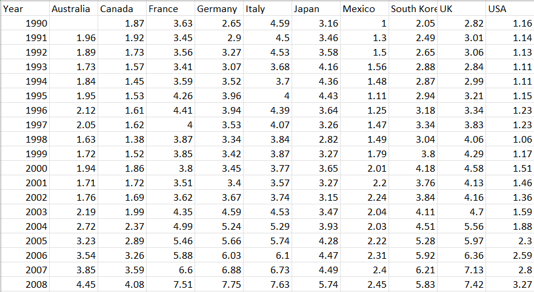

# Fetching Data From SQL

### <mark style="color:purple;">Introduction</mark>&#x20;

_**The internet is a global network of interconnected computers and servers that communicate with each other using a common set of protocols. It allows users to share information, communicate with each other, and access a vast array of resources such as websites, online services, and applications. The internet is based on a client-server model, where users access resources on the internet by connecting to a server using a device such as a computer or smartphone.**_

_**Or we can Simply Say , All machines around the world is interconnected. Something like this:**_

_****_

<figure><figcaption></figcaption></figure>


Each Computer is given an address known as `IP Address.` An IP address is a unique address that identifies a device on the internet or a local network. IP stands for "Internet Protocol," and we are able to fetch data with the help of `IP Address.`


But there is a challenge, How would you fetch data from a Machine that is not switched on, or is not simply connected to internet? Then came **servers.**

### <mark style="color:purple;">Servers</mark>&#x20;

**On the World Wide Web, for example, a Web server is a computer that uses the HTTP protocol to send Web pages to a client's computer when the client requests them.**&#x20;

In simple words, Servers used to get Data from Computer A so that even if Computer A is not Connected , Server can send information to client's Computer.

<figure><figcaption></figcaption></figure>

### <mark style="color:purple;">Two Tier Servers :</mark>&#x20;

#### Application Tier Server :&#x20;

An application tier server is a type of server that is used to host and run application software. It is responsible for processing and managing requests from clients, such as web browsers or mobile devices, and delivering the appropriate responses. The application tier server communicates with databases and other back-end systems to retrieve and store data, and it also handles tasks such as authentication, authorization, and session management.

#### Data Tier Server :&#x20;

A data tier server is a type of server that is used to store and manage data. It is responsible for the physical storage, organization, and retrieval of data in a database or other data storage system. The data tier server is separate from the application tier server, which handles the processing and management of requests and responses. Data tier server is also responsible for ensuring the integrity, security and backup of the data.

<figure><figcaption></figcaption></figure>

### <mark style="color:purple;">What is File System :</mark>&#x20;

A file system is a way for a computer's operating system to organize and keep track of files and folders on a storage device, such as a hard drive. It is responsible for storing, retrieving and updating files as well as managing the available space on the storage device.

Some common challenges in file systems include:

1. \--->**Scalability**: <mark style="color:red;">As the number of users and files increases, the file system must be able to handle the load and continue to function effectively.</mark>
2. \--->**Performance**: <mark style="color:red;">File systems must be able to access files quickly and efficiently, even when dealing with large amounts of data.</mark>
3. \--->**Data Consistency**: <mark style="color:red;">File systems must ensure that data is stored and retrieved consistently, even in the event of power failures or other system failures.</mark>
4. \--->**Data Security**: <mark style="color:red;">File systems must be able to protect data from unauthorized access and ensure data integrity.</mark>
5. \--->**Data Management**: <mark style="color:red;">File systems must be able to organize and manage large amounts of data in an efficient and effective manner.</mark>
6. \--->**Data Backup and Recovery**: <mark style="color:red;">File systems must be able to recover data in the event of data loss or corruption.</mark>
7. \--->**Concurrency and Access Control**: <mark style="color:red;">File systems must be able to handle multiple users accessing the same files at the same time and control access to files.</mark>
8. \--->**File system complexity and compatibility** : <mark style="color:red;">Handling different type of file systems and making them compatible with other systems.</mark>

One of the major problem we had to deal with is Organization. You can save data almost anywhere that makes accessing data , quite difficult.

<figure><figcaption></figcaption></figure>

### <mark style="color:purple;">How Did We Solve This Problem ---> RDBMS (Relational Database Management System)</mark>

A Relational Database Management System (RDBMS) is a type of database management system that uses a relational model to organize data. It **stores data in tables, with each table consisting of rows and columns. The columns represent attributes of the data, and the rows represent individual records.**

**The RDBMS allows users to create, read, update and delete data in the database**. It also provides a way to enforce rules and constraints on the data to ensure the integrity and consistency of the data.

In simpler terms, **RDBMS is a type of software that helps organize, store and retrieve data in a structured way, like a digital spreadsheet. It allows you to create tables and specify relationships between different tables of data, making it easy to search and filter data based on specific criteria.**

<figure><figcaption></figcaption></figure>


There are several tools available for working with Relational Database Management Systems (RDBMS).

Examples include Oracle SQL Developer, MySQL Workbench, and Microsoft SQL Server Management Studio.


### <mark style="color:purple;">Here Came SQL To Interact With RDMBS</mark> :&#x20;

**In simpler terms, SQL is a language that allows you to communicate with a database and retrieve, modify or add information to it. It is like a bridge between the user and the database.**

SQL (Structured Query Language) is a programming language that is used to manage and manipulate relational databases. It is used to insert, update, and query data stored in a relational database management system (RDBMS). SQL allows you to interact with the database by inserting, updating, and retrieving data stored in tables.

SQL is used to perform a variety of tasks, such as:

* Creating and modifying tables, views, and other database objects
* Inserting, updating, and deleting data in the database
* Retrieving data from the database using SELECT statements
* Creating and modifying indexes to improve the performance of queries
* Managing users and controlling access to the database
* Creating and managing constraints to ensure data integrity

**SQL is a standard language used by most RDBMS, like Oracle, MySQL, SQL Server, PostgreSQL, and SQLite, but there are slight variations and differ ent features implemented in each one.**

<figure><figcaption></figcaption></figure>

Now different applications generate Data and server helps us to store them, what we need to do is to fetch data from Server and perform analysis with the help of pandas.

### Introduction To AWS:

\
